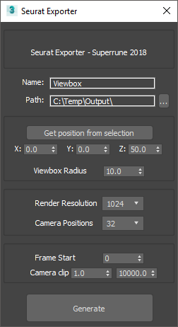

# 3dsmaxSeuratExport

## Overview

This is a script for 3ds Max that will setup the necessary camera data for generating VR images using the Google VR Seurat system. Seurat lets you convert scenes with millions of polygons into an efficient format for rendering on VR devices. It's a fascinating bit of technology that gives high-fidelity VR without having to compress or optimize your 3D scenes.

This script lets you setup rendered input data (a bunch of animated camera frames) from any 3ds Max renderer, with an accompanying JSON data file, which are then ready to be processed using the Seurat Pipeline binary to a realtime 6DoF VR file.

Read more about Seurat here: [Google VR Seurat on Github](https://github.com/googlevr/seurat) \
You can find binaries for Windows here: [Google VR Seurat binaries on Github]https://github.com/ddiakopoulos/seurat/releases \

## How to use

1. Prepare your 3ds Max scene
  * Make sure there is no animation in your scene.
  * Run the 3dsmaxSeuratExport.ms file inside 3ds Max.
2. Adjust the exporter settings
  * Double check the name and output path.
  * Input the position of the camera.
  * Set the viewbox radius to the space you want to move your head (50 cm is a good start).
  * Check that your clipping settings cover the scene.
3. Adjust your render setting
  * Make sure there is no filtering on the antialiasing (samples set to 1)
  * Turn off any motion blur, DOF and glow.
4. Render your frames
5. Process your frames using the Seurat Pipeline binary
  * Copy the Seurat binaries into the same folder as your output
  * Start a Windows PowerShell from the folder, and start the Pipeline binary. Here's how I do it:
  `.\seurat-pipeline-msvc2017-x64.exe -gamma 2.2 -output_path test -input_path manifest.json`
6. Load the resulting files into the Seurat viewer for Unity or Unreal

## The settings explained

Name [default="Viewbox"]: Name prefix for the camera and helpers that are generated. If a scene is loaded, the scene name will automatically be entered here.

Path [default:"C:\Temp\Output\"]: Folder where the rendered images and JSON file will be output. If a scene is loaded, the scene folder + "\output\" will automatically be entered here.

Get position from selection: Click to enter the center of the selection into the position number fields.

X, Y, Z [default: 0.0, 0.0, 50.0]: The center position of the headbox, which all the camera positions will be generated.

Viewbox Radius [default: 10.0]: The radius of the headbox, the volume in which the camera positions will be generated.

Render Resolution [default: 1024]: The resolution of the rendered frames. If the resolution is set to "1024" the image will be 1024 by 1024 pixels.

Camera Positions [default: 32]: The number of camera positions. For each position, six camera directions are rendered. So the actual frames rendered are 32 by 6 = 192 frames. The timeline will be automatically set to the this number of frames after you generate the cameras.

Frame Start [default: timeline start]: Where the camera positions will generate/animate from. Your scenes should be static, but I added this option in the rare case you might have pre-roll or animation rigs that need to animation into position.

Camera clip start and end [default: 1.0 and 100000.0]: The extent of the geometry to analyze. Seurat needs these values to figure out where the geometry is in the scene, and will return an error message if geometry is outside these ranges. I set them pretty large just to be sure.

## Known issues

The script have only been tested with 3ds Max 2018 and Redshift, but should work in other releases or renderers. I have only tested the resulting Seurat files in the tester Binary that comes with Seurat - and not in an actual VR headset. I did not see any changing speculars, which I was hoping was part of the format, and I'm not sure if that is missing or not. Would love to hear feedback if this actually works or not!

Have fun!

